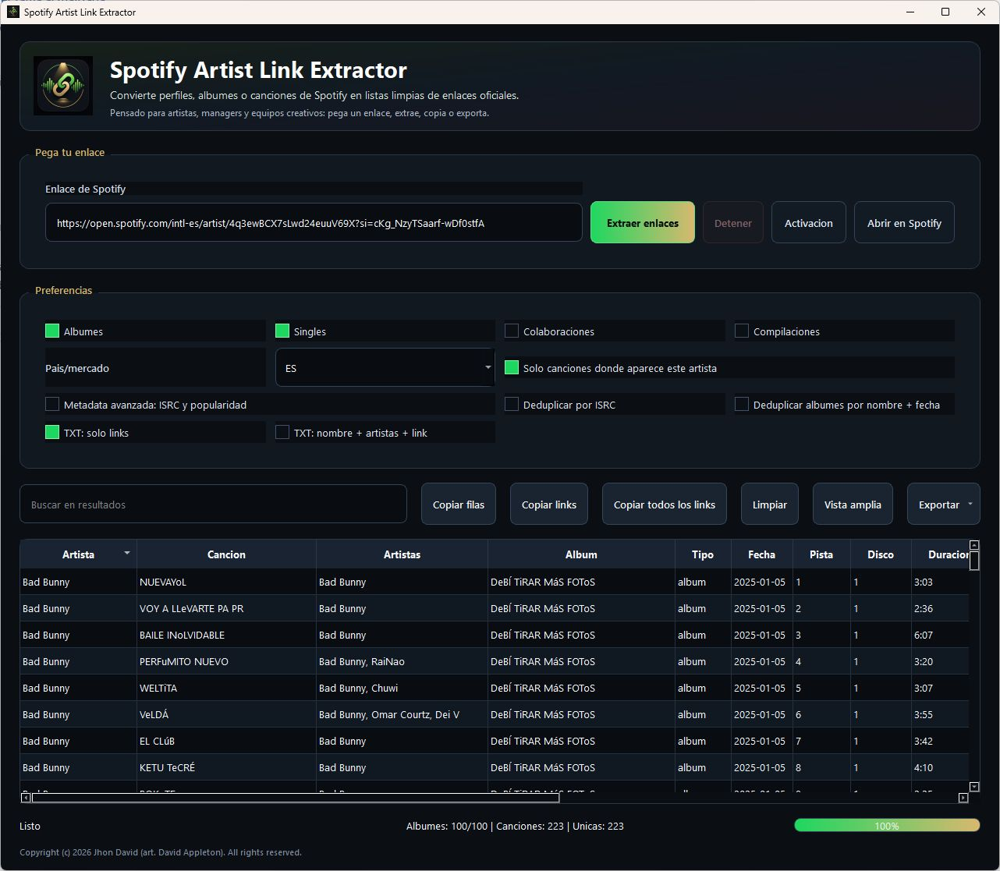
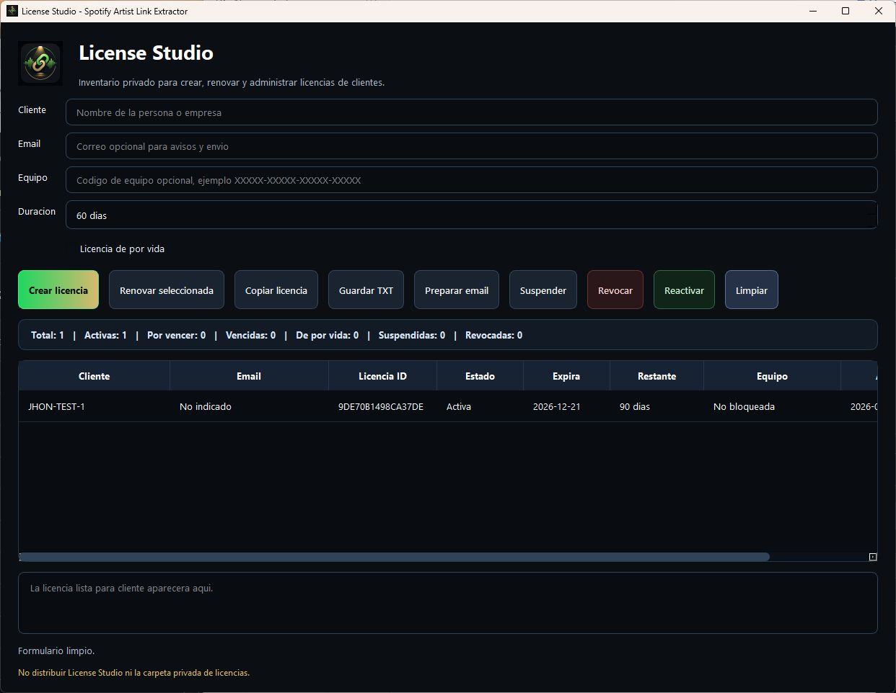

# Spotify Artist Link Extractor

Desktop app in Python 3.11+ to extract official Spotify track links from a Spotify artist profile using the Spotify Web API.

The app does not scrape Spotify pages, does not download audio, and only retrieves metadata plus official track URLs.

It now includes a branded dark interface for creative users, with a premium app mark, clearer Spanish-facing actions, runtime Spotify credential setup, and offline license validation with configurable or lifetime terms.

## Project Preview

### Spotify Artist Link Extractor



### Private License Studio



License Studio is an internal administration tool. It is not included in customer distribution packages.

## Ownership

Copyright (c) 2026 Jhon David (art. David Appleton). All rights reserved.

See [COPYRIGHT.md](COPYRIGHT.md) for the project authorship notice.

## Features

- Paste Spotify artist, album, or track URLs/URIs.
- Supports `open.spotify.com/artist/...`, `/album/...`, `/track/...`, localized URLs like `/intl-es/artist/...`, query strings, and Spotify URIs.
- Uses Spotify Client Credentials OAuth flow.
- Fetches artist albums, singles, appears_on, and compilations with pagination.
- Deduplicates albums and tracks.
- Extracts official Spotify track URLs quickly from artist albums and singles.
- Skips the artist profile endpoint by default to reduce API usage in link-only mode.
- Optional enrichment with ISRC, popularity, and preview URL.
- Optional ISRC/popularity enrichment. It is disabled by default because new Spotify Developer Mode apps can rate-limit or block bulk metadata enrichment.
- Modern branded PySide6 dark desktop UI with sortable/searchable table.
- Exports CSV, TXT, Excel, and JSON.

## Create A Spotify Developer App

1. Go to [Spotify Developer Dashboard](https://developer.spotify.com/dashboard).
2. Sign in with your Spotify account.
3. Click **Create app**.
4. Add an app name and description.
5. Use any valid Redirect URI, for example `http://localhost:8888/callback`.
6. Save the app.
7. Open the app settings and copy:
   - Client ID
   - Client Secret

This desktop tool uses the Client Credentials flow, so it does not need user login or playlist permissions.

## Configure API And License

The distributable build does not include Spotify credentials.

On first launch, the app asks for:

- Spotify Client ID
- Spotify Client Secret
- License key

The values are stored locally in the user's system settings for this app.
The Spotify Client Secret is protected with Windows DPAPI on Windows, the system keyring/keychain when available on macOS/Linux, or a local per-user encrypted fallback.

## Create Customer Licenses

The private license generator creates signed customer activation keys. The private signing key must stay outside Git in `tools/private/ed25519_private_key.txt` or in `SLE_LICENSE_PRIVATE_KEY_B64`.

```bash
python tools/create_license.py "Customer Name" --days 60
python tools/create_license.py "Customer Name" --lifetime
python tools/create_license.py "Customer Name" --days 60 --email customer@example.com --machine-code XXXXX-XXXXX-XXXXX-XXXXX
```

The generated key must be pasted into the app setup dialog.
The app contains only the public verification key, so a distributed `.exe` can verify licenses but cannot create them.

## License Studio

For internal use, open the private license UI with:

```bash
run_license_studio.bat
```

It lets you manage a private customer inventory, associate names and optional emails, bind a license to one device code, create lifetime licenses, renew the same customer/license ID, copy keys, save `.txt` files, and prepare an email draft.
Do not distribute License Studio or `tools/private/`.

The customer app warns when a valid license has 7 days or less remaining, so the user can renew before access expires.

## Install

```bash
python -m venv .venv
.venv\Scripts\activate
pip install -r requirements.txt
```

On macOS/Linux:

```bash
python3 -m venv .venv
source .venv/bin/activate
pip install -r requirements.txt
```

## Build For Distribution

Builds are created per operating system. Run the build on the OS you want to distribute for:

```bash
python tools/build.py app
```

Internal License Studio:

```bash
python tools/build.py license-studio
```

## Run

```bash
python app.py
```

## User Flow

1. Open the app.
2. Enter Spotify API credentials and a valid license if the setup dialog appears.
3. Paste a Spotify artist, album, or track URL/URI.
4. Choose market and album group options.
5. Click **Extract Tracks**.
6. Review the sortable/filterable results table.
7. Export as CSV, TXT, Excel, or JSON.

## Spotify Developer Mode Limits

Spotify may apply strict rate limits to new Developer Mode apps. The app avoids long freezes by refusing to wait for very large `Retry-After` values. Full metadata enrichment can require many individual track requests when Spotify blocks batch metadata, so it is optional and disabled by default. For normal link extraction, leave **Enrich ISRC/popularity metadata** turned off.

## Security Notes

See [docs/SECURITY_AUDIT.md](docs/SECURITY_AUDIT.md) for the latest defensive audit, fixed findings, verification commands, and residual risks.

The default link-only mode uses the smallest practical API surface:

- list artist releases
- list tracks inside each release
- deduplicate by Spotify track ID

It skips full track metadata and artist profile lookups.

## Documentation

Deep project documentation lives in:

- [docs/TECH_SPEC.md](docs/TECH_SPEC.md)
- [docs/DEPLOY_GUIDE.md](docs/DEPLOY_GUIDE.md)
- [docs/CHANGELOG.md](docs/CHANGELOG.md)
